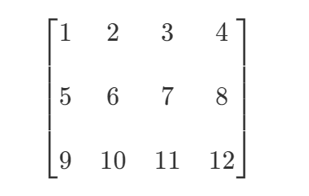

# Python常用数据类型

Date：2019-04-22

## 0. 泛谈数据、数据类型及编程语言特性

大家之前有上过编程的通识课，应该大概知道编程语言中的数据类型有整型int、long，浮点数float、double，布尔值True和False，因而今天的话题“数据类型”乍一看似乎显得比较基础甚至有一些无趣，为了**稍微缓解**这样的尴尬气氛，我们不妨引出这样一个观点并由此展开后续的思考：计算机里面可以操控的数据都有其类型（或者说某一种“格式”），文本文件、图像、音频视频都是数据类型，它们都依从某一种标准或形式来构建自己，也有一系列仅能在此种类型上进行的运算方法。

更广泛地来看，一般我们使用的日频股票价格数据以“代码、时间、开、高、低、收”的形式组织起来，这样的组织形式也可以认为是一个数据类型，它的每一个部分都有具体的对应意义，在此基础上也有一些诸如收益率计算的操作方法可以实施。但是并非每一个人都需要用到“日频股票价格数据”这样的数据类型，有的人可能需要“秒级报价数据”，有的人可能需要“生物DNA片段数据”，有的人可能需要“唐诗三百首”，有的人可能需要“票据和报表”……

正是如此，我们经常听到“Matlab矩阵计算很棒”、“R在统计上表现更好”、“VBA是用来在excel里面写脚本的”、“Lingo算线性规划很快”之类的话语，其实我个人觉得并不是这些语言自带矩阵/统计/电子表格/线性规划的光环，而是它们舍弃了对其他格式的数据的照顾，专攻某一个方面的相关数据类型，甚至只是某一种特殊数据类型及其操作方法，全心全意解决一个问题，这自然“行行出状元”。

但是，光是在我财会用到的编程语言及工具都有十几种，可能只是想就已经耗尽我们文科生的学习动力，所以我wei们le还tou是lan想用一个编程语言解决大部分的问题，还要简单易学好上手的那种。但这有没有可能实现呢？

自然是有的，可以想一想电脑（或者手机）这个事物，同样的品牌、型号和配置，都可以玩扫雷、都有文件管理功能、都有记事本和画图，但是有的人用来写代码，有的人用来开直播，有的人用来看zhui网ju课，有的人用来刷题，有的人用来打Steam游戏……

我们可以很轻松地知道这些不同是因为用户自行装载的软件不一样导致的，从这样的角度来想，Python也是类似的，它为我们提供了基础的一些功能，使我们能敲出这么一行代码：`print("Hello World")`；同时有非常多的包库就像应用市场里面的软件一样为我们提供附加的功能；此外，我们还可以自己去构造一些个性化的软件和功能，只是我们可能换个说法，叫“面向对象编程”。有些名词不大清楚没有关系，今天先与它们相遇，而后再深入了解。

## 1. 常用内置数据类型

所谓内置数据类型（及相关的操作），有些类似于新买来的电脑手机上已经装好的软件程序。既然我们要用Python这个“计算机”，不妨先看看里面内置了些什么“软件”。

### 1.1 数值

这部分比较简单，放几个例子大家浏览下就好。

- 浮点数 float

```Python
>>> x = 1.0
>>> type(x)
float

>>> x = float(1)
>>> type(x)
float
```

- 复数 complex

```Python
>>> x = 2 + 3j
>>> type(x)
complex
```

- 整型 int

```Python
>>> x = 1
>>> type(x)
int

>>> x = 1.0
>>> type(x)
float

>>> x = int(x)
>>> type(x)
int
```

- 布尔值 bool

```Python
>>> x = True
>>> type(x)
bool

>>> x = bool(1)
>>> x
True

>>> x = bool(0)
>>> x
False
```

### 1.2 列表 list

列表是经常会用到的一种线性结构，可以把它看成一个筐，同类型的数据可以放在一起，不同类型的也可以放在一起，就像下面这样：

``` Python
>>> x = [1, 2, 3, 4]
>>> x
[1, 2, 3, 4]

# 二维列表
>>> x = [[1, 2, 3, 4], 
         [5, 6, 7, 8]]
>>> x
[[1, 2, 3, 4], [5, 6, 7, 8]]

# 不同类型数据的筐，其中1 + 0j为复数
>>> x = [1, 1.0, 1 + 0j, 'one', None, True]
>>> x
[1, 1.0, (1 + 0j), 'one', None, True]
```

列表有丰富的切片和删改操作可供大家玩耍。所谓“切片”，就是将原有列表的一部分单独切分出来进行操作，类似下面这样：

```Python
>>> x = [0, 1, 2, 3, 4, 5, 6, 7, 8, 9]
>>> x[5]
5

>>> x[4:]
[4, 5, 6, 7, 8, 9]

>>> x[:4]
[0, 1, 2, 3]

>>> x[1:4]
[1, 2, 3]

# 二维列表切片
x = [[1, 2, 3, 4],
     [5, 6, 7, 8]]
>>> x[0]
[1, 2, 3, 4]

>>> x[0][0]
1

>>> x[0][1:4]
[2, 3, 4]
```

至于删改操作则有下面的一些情形：

```Python
# 初始化列表
>>> x = [0, 1, 2, 3, 4, 5, 6, 7, 8, 9]

# 增加一个元素，其值为0
>>> x.append(0)
>>> x
[0, 1, 2, 3, 4, 5, 6, 7, 8, 9, 0]

# 求当前列表长度
>>> len(x)
11

# 将[11, 12, 13]添加到当前列表中
>>> x.extend([11, 12, 13])
>>> x
[0, 1, 2, 3, 4, 5, 6, 7, 8, 9, 0, 11, 12, 13]

# 删除第1个到第4个元素
>>> del x[:3]
>>> x
[4, 5, 6, 7, 8, 9, 0, 11, 12, 13]

# 删除全部元素
>>> del x[:]
>>> x
[]
```

### 1.3 字典 dict

字典是一个以“键-值对”组织的数据集合，这里的“键”可以想象为是房间的门牌号，而其对应的值则对应地可以认为是房间里面的东西。它的魅力可能要到后期项目中才便于展现，这里我们先对它有一点直观的了解：

```Python
# 创建一个字典
# 其中有三个键'name', 'year', 'group'
# 对应的值分别是'xincaijing', 2019, 'coding'
>>> data = {'name': 'xincaijing', 'year': 2019, 'group': 'coding'}
>>> type(data)
dict

>>> data['name']
xincaijing
```

### 1.4 其他说明

基础的数据类型还有字符串和元组这两类，字符串明天和文件处理一起分享，元组后面会有性能优化方面的小专题，届时再把它邀请过来。

## 2. 今日小练习

（1） 安装Python环境（如果之前没有安装的话）

（2） 3：有如下列表，按照要求实现每一个功能
`groups = ['跑马组', '美食组', '健身组', '春游组', '电影组', '唱歌组', '品茶组']`

- 计算列表长度并输出；
- 列表末尾中追加一个元素'编程组'，并输出添加后的列表；
- 在第二个位置插入元素'麻将组'；
- 删除第7个元素；
- 将列表中所有元素反转；

（3）利用两个列表嵌套的方法存放如下矩阵，

$$\begin{bmatrix}1 & 2 & 3 & 4\\\\5 & 6 & 7 & 8\\\\9 & 10 & 11 & 12\end{bmatrix}$$


并取出第3行第4列的数。

（4）`[1, 2, 3] + [4, 5, 6]`的结果是多少？

（5）【边缘试探】搜索了解`sort()`和`sorted()`方法并用它们对列表排序，`list = [0, -1, 3, -10, 5, 9]`.

（6）【眺望明天】尝试从字符串`'Python is an interesting and useful language for numerical computing!'`中提取出字符切片`nohtyP`.
